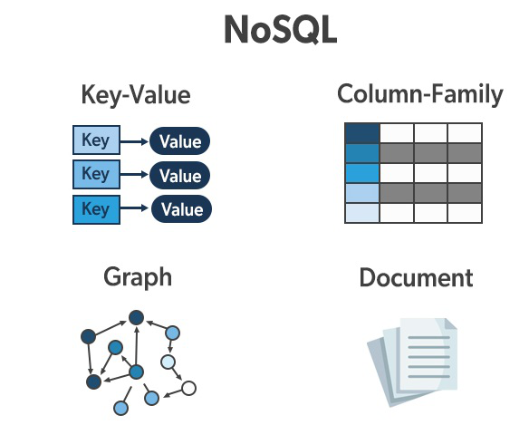

> 1번 주제 : 데이터베이스란 무엇이고, 어떤 종류가 있으며, 관계형 데이터 베이스란 무엇인가 
> 1. 데이터 베이스는 왜 필요할까?
> 2. 데이터베이스에는 무슨 종류가 있는가?
> 3. 관계형 데이터베이스를 어떻게 표현할 수 있을까?
>   - ERD란 무엇인가?
>   - ERD의 요소에는 무엇이 있는가?

## 데이터베이스란
데이터를 영구적으로 저장하고 사용하기 위한 저장소로, 다양한 방식으로 데이터를 저장하고 관리하며 이 방식은 데이터베이스의 종류에 따라 결정된다.

데이터베이스를 통해 데이터를 저장하면 다음과 같은 이점이 있다.
- 데이터를 조직화하여 데이터에 의미가 생긴다.
- 대량의 데이터를 효율적으로 관리할 수 있다.

데이터를 조직화하는 방법에는 여러가지가 있는데, 관리하는 방식에 따라 데이터베이스의 종류를 구분할 수 있다.

### 데이터베이스 관리 시스템(DBMS)
데이터베이스를 실제로 구현하기 위해 일반적으로 DBMS라는 것을 사용한다. 

연결할 애플리케이션, 데이터, DBMS 솔루션을 하나로 묶어 데이터베이스 시스템이라고 하고 단축하여 데이터베이스라고도 한다.

데이터베이스라는 단어는 원론적으로는 데이터베이스의 모음을 의미하지만, 데이터를 조직하는 유형별로, 혹은 DBMS 솔루션까지 묶어서 데이터베이스라고 부르기도 한다.

## 데이터베이스 종류
대표적으로 관계형 데이터베이스가 있으며 SQL이라고도 부른다. 반대로 관계형 데이터베이스가 아닌 데이터베이스는 비관계형 데이터베이스 혹은 NoSQL이라고 칭한다. 

### 관계형 데이터베이스(Relational Database)
> 고정된 행(row)과 열(column)로 구성된 테이블에 데이터를 저장하는 데이터베이스이다.

각 열은 하나의 속성에 대한 정보를 저장하고, 행에는 각 열의 데이터 형식에 맞는 데이터가 저장된다.

테이블의 구조와 데이터 타입등을 사전에 정의하여사용하며, **테이블에 정의된 타입에 해당되는 데이터만 삽입할 수 있다.**

-> 데이터를 정확히 입력하면 사용하기 편하다. 

**데이터의 중복을 피하기 위해 '관계'를 이용**한다.

대표적인 관계형 데이터베이스 DBMS(RDBMS)는 다음과 같다.
- MySQL
- Oracle
- SQLite
- MariaDB
- PostgresSQL

장점
- 명확하게 정의된 스키마, 데이터 무결성 보장
- 관계는 각 데이터를 중복 없이 한번만 저장

단점
- 덜 유연하다 -> 스키마를 사전에 계획하고 알려야 함(수정이 어렵다.)
- 관계를 맺고 있어서 `JOIN`문이 많은 복잡한 쿼리가 만들어질 수 있다.

#### SQL 
RDBMS의 데이터를 관리하기 위해 설계된 프로그래밍 언어로 질의어라고도 부른다. 관계형 데이터베이스 관리 시스템에서 자료 조회, DB 스키마 생성, 데이터베이스 객체 접근 조정 관리를 위해 고안되었다.

관계형 데이터베이스를 위해 만들어졌기 때문에 전용 프로그래밍 언어로 볼 수 있다.

### 비관계형 데이터베이스(NoSQL)

> 관계형 데이터베이스를 제외한 나머지 모든 유형은 NoSQL로 분류되며, 데이터 저장과 접근 방식을 유연하게 제공하는 데이터베이스 시스템이다.

기본적으로 NoSQL은 대용량 데이터를 다루는 것에 초점을 맞추고 있다. RDBMS와는 다른 것에 집중하고 있다고 볼 수 있다.

스키마가 유연하고 쉽고 빠른 설치가 가능하다 -> 확장에 용이하며 특정 작업에 최적화된 데이터 구조를 통해 성능을 극대화 시킬 수 있다.

다루는 데이터에 따라 다양한 형태의 데이터베이스가 존재하는데 대표적으로 다음과 같은 형태의 DB가 있다.

- Document Database
    - ex. MongoDB
- Key-value
    - ex. Redis
- Column-based
    - ex. Cassandra
- Graph-based
    - ex. Neo4J

## 관계형 DB의 표현 방법
### ERD
### ERD 요소