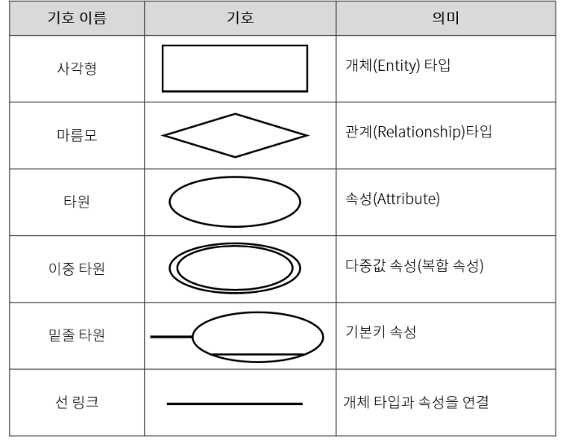
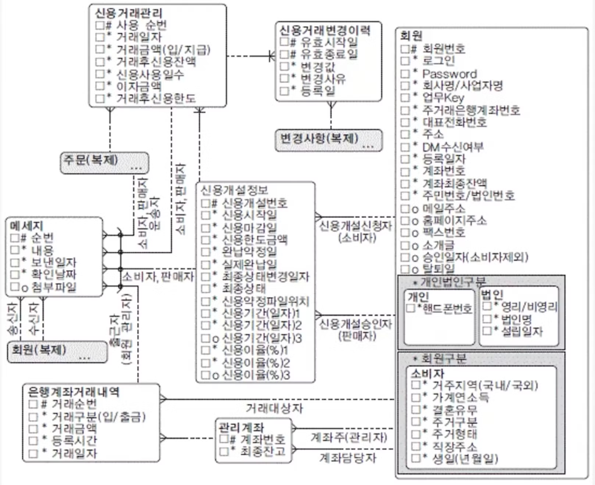
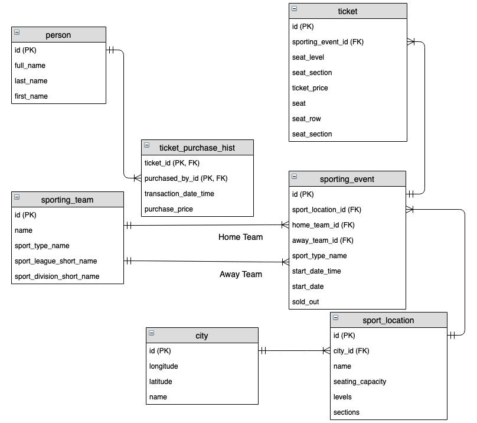

> 1번 주제 : 데이터베이스란 무엇이고, 어떤 종류가 있으며, 관계형 데이터 베이스란 무엇인가 
> 1. 데이터 베이스는 왜 필요할까?
> 2. 데이터베이스에는 무슨 종류가 있는가?
> 3. 관계형 데이터베이스를 어떻게 표현할 수 있을까?
>   - ERD란 무엇인가?
>   - ERD의 요소에는 무엇이 있는가?

## 데이터베이스란
데이터를 영구적으로 저장하고 사용하기 위한 저장소로, 다양한 방식으로 데이터를 저장하고 관리하며 이 방식은 데이터베이스의 종류에 따라 결정된다.

데이터베이스를 통해 데이터를 저장하면 다음과 같은 이점이 있다.
- 데이터를 조직화하여 데이터에 의미가 생긴다.
- 대량의 데이터를 효율적으로 관리할 수 있다.

데이터를 조직화하는 방법에는 여러가지가 있는데, 관리하는 방식에 따라 데이터베이스의 종류를 구분할 수 있다.

### 데이터베이스 관리 시스템(DBMS)
데이터베이스를 실제로 구현하기 위해 일반적으로 DBMS라는 것을 사용한다. 

연결할 애플리케이션, 데이터, DBMS 솔루션을 하나로 묶어 데이터베이스 시스템이라고 하고 단축하여 데이터베이스라고도 한다.

데이터베이스라는 단어는 원론적으로는 데이터베이스의 모음을 의미하지만, 데이터를 조직하는 유형별로, 혹은 DBMS 솔루션까지 묶어서 데이터베이스라고 부르기도 한다.

## 데이터베이스 종류
대표적으로 관계형 데이터베이스가 있으며 SQL이라고도 부른다. 반대로 관계형 데이터베이스가 아닌 데이터베이스는 비관계형 데이터베이스 혹은 NoSQL이라고 칭한다. 

### 관계형 데이터베이스(Relational Database)
> 고정된 행(row)과 열(column)로 구성된 테이블에 데이터를 저장하는 데이터베이스이다.

각 열은 하나의 속성에 대한 정보를 저장하고, 행에는 각 열의 데이터 형식에 맞는 데이터가 저장된다.

테이블의 구조와 데이터 타입등을 사전에 정의하여사용하며, **테이블에 정의된 타입에 해당되는 데이터만 삽입할 수 있다.**

-> 데이터를 정확히 입력하면 사용하기 편하다. 

**데이터의 중복을 피하기 위해 '관계'를 이용**한다.

대표적인 관계형 데이터베이스 DBMS(RDBMS)는 다음과 같다.
- MySQL
- Oracle
- SQLite
- MariaDB
- PostgresSQL

장점
- 명확하게 정의된 스키마, 데이터 무결성 보장
- 관계는 각 데이터를 중복 없이 한번만 저장

단점
- 덜 유연하다 -> 스키마를 사전에 계획하고 알려야 함(수정이 어렵다.)
- 관계를 맺고 있어서 `JOIN`문이 많은 복잡한 쿼리가 만들어질 수 있다.

#### SQL 
RDBMS의 데이터를 관리하기 위해 설계된 프로그래밍 언어로 질의어라고도 부른다. 관계형 데이터베이스 관리 시스템에서 자료 조회, DB 스키마 생성, 데이터베이스 객체 접근 조정 관리를 위해 고안되었다.

관계형 데이터베이스를 위해 만들어졌기 때문에 전용 프로그래밍 언어로 볼 수 있다.

### 비관계형 데이터베이스(NoSQL)

> 관계형 데이터베이스를 제외한 나머지 모든 유형은 NoSQL로 분류되며, 데이터 저장과 접근 방식을 유연하게 제공하는 데이터베이스 시스템이다.

기본적으로 NoSQL은 대용량 데이터를 다루는 것에 초점을 맞추고 있다. RDBMS와는 다른 것에 집중하고 있다고 볼 수 있다.

스키마가 유연하고 쉽고 빠른 설치가 가능하다 -> 확장에 용이하며 특정 작업에 최적화된 데이터 구조를 통해 성능을 극대화 시킬 수 있다.

다루는 데이터에 따라 다양한 형태의 데이터베이스가 존재하는데 대표적으로 다음과 같은 형태의 DB가 있다.

- Document Database
    - ex. MongoDB
- Key-value
    - ex. Redis
- Column-based
    - ex. Cassandra
- Graph-based
    - ex. Neo4J

## 관계형 DB의 표현 방법
관계형 데이터베이스를 표현하는 방식은 대표적으로 ERD가 있으며 그 외에도 다음과 같은 방식들이 있다.
- 데이터베이스 스키마
    - 데이터베이스의 전체 **구조와 조직을 정의하는 메타데이터**, 데이터베이스 구성에 대한 설계도로 볼 수 있다.
    - 실제 데이터베이스 객체들의 정의(테이블 뷰, 인덱스, 프로시저 등) 집합
    - 개념/논리/물리 스키마 등이 있다.
- 릴레이션 스키마(테이블 정의)
    - 관계형 데이터베이스에서 개별 테이블(릴레이션)의 구조를 정의
    - 특정 릴레이션의 이름과 해당 릴레이션에 포함될 속성들의 이름, 타입, 제약 조건(기본 키, 외래 키, NOT NULL 등)을 명시한다.
    - SQL DDL 구문을 사용하여 표현 가능 (ex. `CREATE TABLE`)
- 데이터 사전 / 시스템 카탈로그
    - 데이터베이스 내의 **모든 데이터 객체(테이블, 컬럼, 인덱스. 뷰, 사용자 등)에 대한 자세한 메타데이터** 정보를 저장하는 저장소
    - 데이터베이스 시스템 자체에서 관리하거나 사용자가 직접 정의할 수 있다

### ERD
ERD는 개체-관계 다이어그램(Entity-Relationship Diagram)의 약자로, 데이터베이스의 논리적 구조를 시각적인 다이어그램으로 표현하는 모델링 기법이다.

실제 데이터베이스를 구축하기 전에 어떤 데이터들이 존재하고, 이 데이터들 간에 어떤 관계가 있는지를 한 눈에 알아보기 쉽게 도식화하는 데 사용되는 설계도라고 할 수 있다.

ERD는 크게 3가지 종류가 있다.
| 종류                             | 특징                    | 예시 기호                                         |
| ------------------------------ | --------------------- | --------------------------------------------- |
| **개념적 ERD** | 개념 중심, 비즈니스 분석용       | 사각형(Entity), 타원(Attribute), 마름모(Relationship) |
| **논리적 ERD** | 관계형 모델로 구조화, 정규화 반영   | PK, FK, 관계선 표시                                |
| **물리적 ERD** | 실제 DB 관점, 자료형/제약조건 포함 | 테이블 모양, 컬럼 타입까지 명시                            |

#### ERD의 요소
크게 세 가지 주요 구성 요소가 있다.

##### 1. 개체 (Entity)

현실 세계에서 데이터로 표현 될 수 있는, 정보를 저장할 수 있는 대상이다.
- ex. 고객, 상품, 주문, 학생, 과목 등

다이어그램에서는 사각형으로 표현된다.

##### 2. 속성 (Attribute)

개체가 가지는 특성 또는 정보의 단위를 말한다. 속성을 통해 개체에 대해 구체적으로 설명할 수 있다.

- ex. 고객의 'ID', '이름', '주소', '전화번호' 등

다이어그램에서는 보통 타원이나 원형으로 표현하고, 해당 속성이 어떤 개체의 속성인지 선으로 연결하여 나타낸다.

속성 중에서 각 데이터 인스턴스를 구별하는데 사용되는 속성을 식별자(Key)라고 한다. 대표적으로 다음과 같은 식별자가 있다.
- 식별자(Primary Key, PK) : 개체를 유일하게 식별할 수 있는 속성
- 외래 식별자(Foreign Key, FK) : 다른 개체의 식별자를 참조하여 **관계를 나타내는 속성**

##### 3. 관계 (Relationship)
관계는 두 개체 간의 연관성이나 상호작용을 나타낸 것이다. 한 개체의 인스턴스가 다른 개체의 인스턴스와 어떻게 연관되어 있는지를 설명한다.

ex. "`고객`이 `상품`을 `주문`한다", "`교수`가 `강의`를 담당한다"

다이어그램에서는 보통 마름모 형태로 표현되며, 관계에 참여하는 개체들을 선으로 연결한다.

관계가 두 인스턴스 간의 대응 개수가 몇개인지에 따라 다음과 같이 구분된다.

- 1:1 관계
    - 한 개체의 하나의 인스턴스가 다른 개체의 하나의 인스턴스랑'만' 연관된다.
    - ex. 한 '회원'은 하나의 '프로필 사진'을 가진다.
- 1:N 관계
    - 한 개체의 하나의 인스턴스가 다른 개체의 여러 인스턴스와 연관될 수 있지만, 다른 개체의 하나의 인스턴스는 한 개체의 하나의 인스턴스와만 연관된다.
    - ex. 한 '회원'은 여러 '게시글'을 작성할 수 있지만, 한 '게시글'은 하나의 '작성자(회원)'만 가질 수 있다.
- N:M 관계
    - 한 개체의 여러 인스턴스가 다른 개체의 여러 인스턴스와 연관될 수 있다.
    - ex. 하나의 '상품'은 여러 개의 '주문'에 속할 수 있고, 하나의 '주문'은 여러 개의 '상품'을 포함할 수 있습니다.