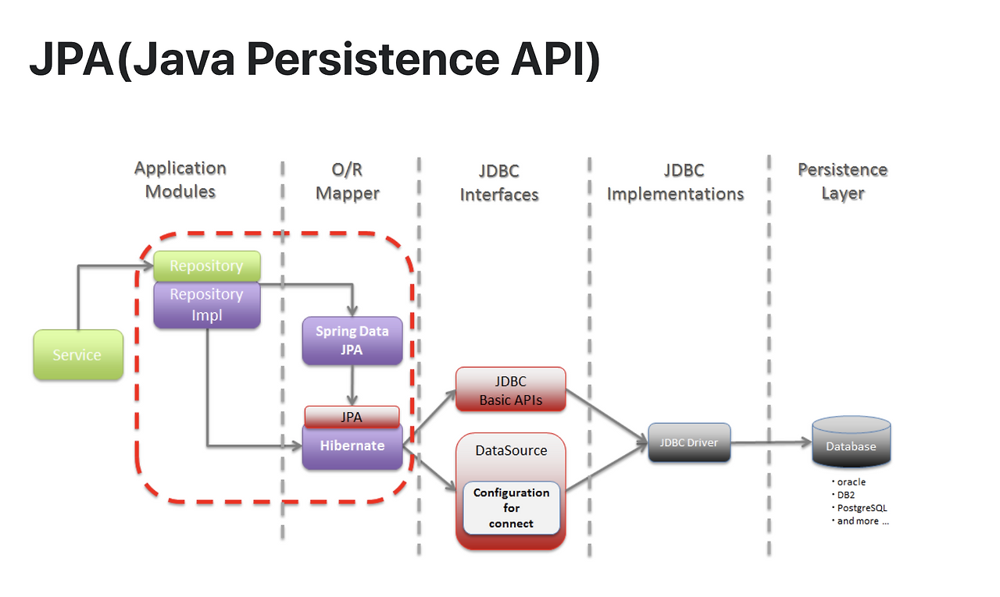

> 2번 주제 : ORM은 무엇이고 스프링에서 어떻게 이용할 수 있는가
> - ORM은 무엇이고 왜 필요할까
> - 스프링에서 ORM을 어떻게 활용하는가
>     - Spring Data JPA
>     - Repository Layer
>     - JpaRepository Interface에는 어떤 기능이 포함되어 있는가

## ORM
> ORM(Object-Relational Mapping)은 객체 지향 프로그래밍 언어에서 사용하는 객체와 관계형 데이터베이스에서 사용하는 데이터를 서로 매핑해주는 기술이다.

개발자 혹은 개발자가 만든 프로그램이 데이터베이스와 상호작용을 할 때 SQL 쿼리를 직접 작성하는 것이 아니라 객체 지향 코드(클래스, 인스턴스, 메서드)를 사용하여 데이터베이스 데이터를 다룰 수 있게 해주는 도구다.

### 사용법
ORM 없이 `User`라는 객체에 `id`, `name` 등의 속성을 정의하고 그 값을 `users`라는 테이블로부터 가져와서 저장하고 조회하는 경우를 가정하면 다음과 같이 코드를 작성할 수 있다.
```
insertQuery = "INSERT INTO users (id,name) VALUES (?,?)"
selectQuery = "SELECT id, name FROM users WHERE id = ?"
```
이렇게 SQL을 문자열 형태로 작성하여 DB와 상호작용하는 메서드를 호출하고 인수로 넘겨야 한다.
```
mysql.query(insertQuery, [1,3])
```

여기서 ORM 을 사용하면 직접 SQL을 작성하지 않아도 ORM이 `User` 객체와 `users` 테이블이 대응되는 것을 알고있기 때문에 메서드만 호출해도 객체의 속성을 분석하여 SQL 쿼리를 생성하고 실행한다.

```Java
User userObject = new User();
userRepository.save(userObject)
```

### ORM을 쓰는 이유

1. 개발 생산성 향상
    - 반복적인 SQL 쿼리를 작성하는 시간이 줄어들고, 비즈니스 로직 구현에 집중할 수 있어 개발 생산성이 향상된다.
    - 직접 DB를 다루지 않고 객체 지향적으로 코드를 작성할 수 있다. -> 객체지향에 익숙하다면 개발 속도가 빨라진다.

2. 객체-관계 불일치 해결
    - 객체 지향 프로그래밍과 관계형 데이터베이스는 데이터를 다루는 방식에 근본적인 차이가 있다. ORM을 통해 이 간극을 메울 수 있다.
        - 객체 지향의 상속 개념은 관계형 DB에 직접 매핑되지 않는다.
        - 객체는 참조를 통해 다른 객체로 탐색하지만, DB는 조인(JOIN)을 통해 데이터를 가져오는 차이가 있다.
3. 데이터베이스 종속성 감소
    - 데이터베이스 종류 마다 SQL을 쓰더라도 세세한 문법이 다른 경우가 있다. 이에 의존적이지 않고 객체 방식으로 데이터를 다루기 때문에 데이터베이스를 변경 하더라도 ORM 설정만 변경하는 등 코드 수정을 최소한으로 할 수 있다.
4. 유지보수성 및 코드 가독성
    - SQL 쿼리를 코드 곳곳에 삽입하는 것에 비해, 데이터 접근 로직을 한 곳(Repository 계층)에서 관리할 수 있어 코드 구조가 명확해진다.

## Spring에서 ORM
스프링에서 사용하는 대표적인 ORM은 JPA다.

- JPA (Java Persistence API)
    - 자바 표준 ORM 명세 -> '인터페이스' 모음
    - JPA 인터페이스를 구현한 프레임워크가 `Hibernate`
- Hibernate
    - JPA 구현체 중 가장 많이 쓰이는 라이브러리(사실상 표준)
- Spring Data JPA
    - JPA 위에 올라가는 추상화 레이어
    - JPA를 편리하게 사용할 수 있도록 지원하는 프로젝트(모듈)
    - JPA를 사용할 때 필수적으로 생성해야하나, 예상가능하고 반복적인 코드를 대신 작성한다.
        - 이는 JPA를 한 단계 추상화 시킨 `Repository`라는 인터페이스를 제공함으로써 이루어진다.
    - ⭐Spring Data JPA는 항상 하이버네이트 같은 JPA provider가 필요하다.

### JPA 구성 요소
JPA 구성 요소는 다음과 같다.
- Entity : 테이블과 매핑되는 도메인 객체. @Entity 어노테이션 사용.
- EntityManager : 엔티티를 저장/조회/삭제하는 JPA의 핵심 객체.
- Persistence Context : 엔티티를 1차 캐시로 관리하는 논리적인 저장소.
- Spring Data JPA Repository : JpaRepository를 상속받아 CRUD 기능 제공.
- Transaction : `@Transactional`을 통해 트랜잭션 경계를 관리.

보통 Entity + Repository + Service를 작성하고, EntityManager를 직접 다루는 일은 잘 없다.


### Repository Layer
Repository는 데이터 접근 계층으로 도메인 객체(Entity) 중심 개발을 가능하게 해준다. SQL을 숨기고 객체 중심의 접근을 보장하는 추상화 계층

Spring Data JPA에서 Repository는 다음과 같이 생성한다.
```Java
public interface UserRepository extends JpaRepository<User, Long> {
}
```

Repository는 다음과 같은 기본 제공 기능이 있다.
```Java
// 유저 생성
User user = new User(...);
productRepository.save(user);

// 유저 전체 조회
List<User> users = userRepostiory.findAll();

// 유저 수 조회
long count = userRepository.count();

// 유저 삭제
userRepository.delete(user);
```
JpaRepository는 기본 CRUD, 페이징/정렬을 자동 제공하며,
메서드 이름만 선언해도 Spring Data JPA가 내부적으로 적절한 쿼리를 구현해준다.(쿼리 메서드)

그 외에도 JPQL, Entity 수정 감지하여 자동 UPDATE 등 다양한 기능을 지원한다.

### 동작 흐름


- Application: Service → Repository(인터페이스)
- O/R Mapper: Spring Data JPA → JPA(Hibernate)
- JDBC: JDBC Basic APIs, DataSource(커넥션 풀), JDBC Driver
- DB: 실제 SQL 실행(Oracle, PostgreSQL 등)

요청 처리 순서는 다음과 같다. 

1. Service가 Repository(JpaRepository) 메서드 호출
2. Spring Data JPA가 구현체(프록시)로 EntityManager에 위임
3. JPA/Hibernate가 JPQL/엔티티 상태를 SQL로 생성
4. JDBC + DataSource + Driver가 DB에 전송 및 실행
5. ResultSet → 엔티티로 매핑되어 Repository → Service로 반환
6. 커밋 시점 Dirty Checking으로 변경 SQL 자동 실행

