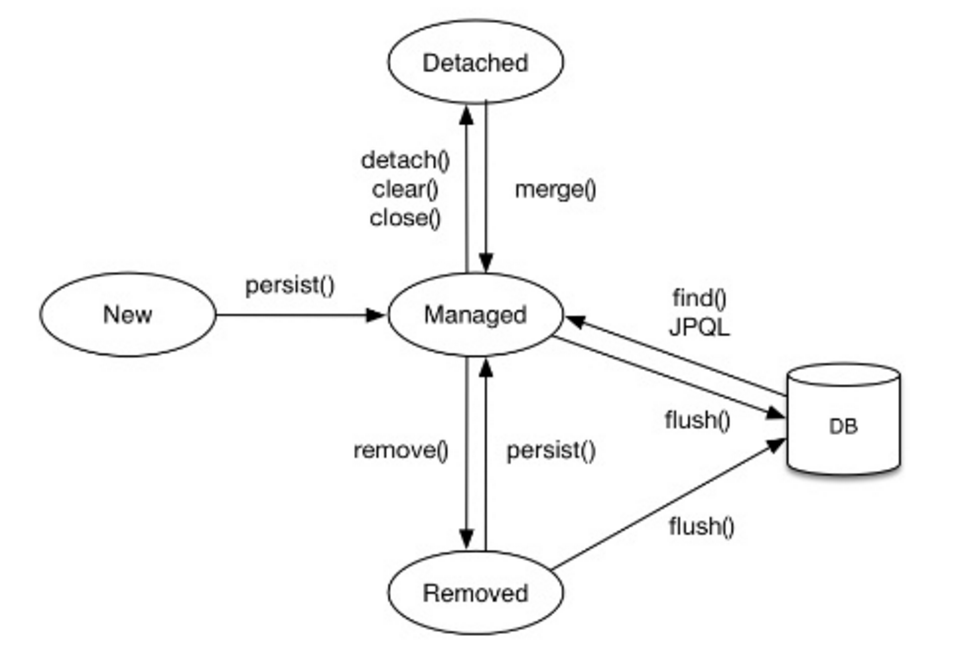

> Entity는 무엇이고 생명주기는 어떻게 되나요? 관련 어노테이션은?
> - Entity는 무엇인가요?
> - 영속성은 무엇일까요?
>   - Entity의 생명주기는 어떻게 되나요?
>   - Entity에 관련된 어노테이션은 무엇이 있나요?

## Entity
앞서 데이터 모델링 관점에서의 Entity, JPA에서 Entity 모두 가볍게 정의하였다.
정리하자면 다음과 같다.

- 데이터 모델링에서 Entity : 현실 세계의 요소를 시스템에서 다루는 경우 데이터로 존재하는 대상
- JPA에서 Entity : 데이터베이스 테이블과 매핑되는 도메인 객체

JPA에서 Entity는 다음과 같이 사용한다.
```Java
@Entity
public class Member {
    @Id
    @GeneratedValue
    private Long id;
    private String name;
}
```

## 영속성
> 영속성(Persistence)는 데이터가 애플리케이션이 종료되어도 지속적으로 저장되는 성질을 말한다. 

메모리 정보 처럼 프로그램 종료 시 사라지는 것이 아닌, DB나 파일 형태로 영구 저장되는 경우를 영속이라고 말한다.

영속성은 객체의 생명주기를 DB까지 확장시키는 개념이다. 

JPA에서는 영속성 컨텍스트(Persistence Context)가 엔티티를 관리하여, DB에 반영되도록 보장한다

### Entity 생명주기
Entity는 다음과 같은 상태로 구분된다.

- 비영속(new/transient)
    - 영속성 컨텍스트와 전혀 관계가 없는 상태
    - 객체를 생성'만' 한 상태
- 영속(managed)
    - 영속성 컨텍스트에 저장된 상태 -> Entity가 영속성 컨텍스트에 의해 관리되는 상태
    - `EntityManager.persist(entity);`
        - 영속 상태가 된다고 DB에 바로 쿼리가 날아가진 않음(저장 X)
    - `transaction.commit();`
        - 트랜잭션의 commit 시점에 영속성 컨텍스트에 있는 정보들이 DB에 쿼리로 날아간다.
- 준영속(detached)
    - 영속성 컨텍스트에 저장되었다가 분리된 상태
    - 영속성 컨텍스트에서 지운 상태
    - `entityManager.detach(member);`
- 삭제(removed)
    - 실제 DB 삭제를 요청한 상태
    - `entityManager.remove(member);`


### Entity 관련 어노테이션
> 어노테이션은 소스 코드가 컴파일되거나 실행될 때 컴파일러 및 다른 프로그램에게 필요한 정보를 전달해 주는 문법 요소

- `@Entity` : JPA를 사용해 테이블과 매핑할 클래스에 붙여주는 어노테이션
- `@Table` : 엔티티와 매핑할 테이블을 지정하는 어노테이션
- `@Id` : 특정 속성을 기본키로 설정하는 어노테이션
- `@Column` : 객체 필드를 테이블 컬럼과 매핑한다
    - name : 테이블의 컬럼 이름 지정
    - insertable : true면 엔티티 저장시 필드값 저장
    - updatable: true면 엔티티 수정시 값이 수정
    - table : 하나의 엔티티를 두 개 이상의 테이블에 매핑할때 사용
    - nullable : null값 허용 여부 설정
    - unique : 컬럼에 유니크 제약조건 부여
    - columnDefinition : 데이터베이스 컬럼 정보를 직접 부여
    - length : 문자 길이 제약 조건  ex. VARCHAR(15)
- `@Access` : JPA가 엔티티 데이터에 접근하는 방식 지정, 설정하지 않으면 기본키를 설정하는 `@Id`의 위치를 기준으로 접근 방식 설정
- `@Enumerated` : 자바 enum 타입을 매핑할 때 사용
- `@Temporal` : 날짜 타입 매핑시 사용
- `@Lob` : DB BLOB, CLOB 타입과 매핑
- `@Transient` : 이 어노테이션을 붙인 필드는 DB에 저장하지도 조회하지도 않는다. (임시 보관시 사용)
