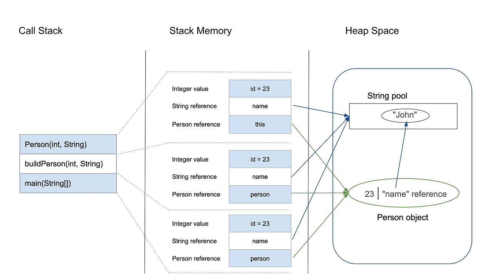

> 객체의 직렬화와 역직렬화는 무엇이고 `@RequestBody`와 `@ModelAttribute`의 값 매핑은 어떻게 이뤄지는가
> 1. Controller의 메소드 내 아무런 어노테이션이 없을 때 스프링은 이 값들을 어떻게 처리할까
> 2. 스프링에서 객체의 직렬화와 역직렬화는 어떻게 이뤄질까
  >    - ObjectMapper의 작동방식
>    - `@RequestBody`와 `@ModelAttribute`는 어떤 차이가 있을까?

## 객체의 직렬화 역직렬화
> - 직렬화:  프로그램 내부에서 사용하는 객체나 데이터를 다른 프로그램에 전달하여 사용할 수 있도록 데이터의 형태를 바이트 (Byte) 형태로 변환하는 것을 의미한다.
> - 역직렬화: 바이트 형태로 받은 정보를 프로그램 내에서 다루는 것이 가능한 객체 형태로 다시 변환하는 것을 의미한다.

대표적으로는 JSON이 있으며, 그 외에도 CSV, XML 등의 문자열 형태로 직렬화도 가능하다. 중요한 것은 '객체를 다른 프로세스로 **전송 가능한 형태**로 변환한다'는 것

### 직렬화를 하는 이유?
자바에서 객체타입은 참조 형식(Reference Type)이다. 

스택 메모리에는 값 형식 데이터나 힙 영역에 있는 객체의 주소를 가리키는 참조 형식의 데이터가 저장된다.

힙 메모리에는 메모리가 할당되고 실제 객체 데이터가 저장된다. 그리고 스택 메모리의 참조 형식이 이 힙 메모리의 주소를 참조하고 있다.

객체를 네트워크 상으로 송수신할 때 객체를 직렬화하지 않으면 객체의 참조 형식을 그대로 가져오게 된다. A서버와 B서버가 통신을 한다고 할 때, A에서 객체의 주솟값을 B에 전송할 경우 B는 이 주솟값을 받아도 A 서버의 힙 메모리 영역에 접근할 수는 없기 때문에 어떤 데이터인지 파악할 수 없다.

### `@RequestBody` vs `@ModelAttribute`
`@RequestBody`와 `@ModelAttribute`는 클라이언트 측에서 보낸 데이터를 Java 코드에서 사용할 수 있는 오브젝트로 만들어주는 공통점이 있다. 하지만 두 애너테이션은 세부 수행 동작에서 큰 차이를 보인다. 
`@RequestBody`
- HTTP 요청 바디로 부터 받아온다.
- JSON/XML API 바디를 객체로 받는 경우 `HttpMessageConverter`가 역직렬화한다. (ex. JSON -> POJO)
  - `HttpMessageConverter` :  직렬화, 역직렬화 과정에서 사용하는 핵심 컴포넌트
- `@Valid`로 역직렬화 실패, 검증 실패에 대해 다룰 수 있다.
- RequestBody를 사용할 객체는 필드를 바인딩할 **생성자나 setter 메서드는 필요 없지만 기본 생성자는 필요**하다. + 바인딩을 위한 필드명을 알아내기 위해 getter나 setter중 1가지는 정의되어 있어야 한다. 

`@ModelAttribute`
- 요청 파라미터(query string, application/x-www-form-urlencoded 폼 필드, multipart/form-data 의 텍스트 필드)로 부터 데이터를 받아온다.
- 스프링의 WebDataBinder를 통해 자바빈 프로퍼티에 바인딩한다.
- 주로 폼 전송, 검색 조건에 대한 DTO, 쿼리 파라미터 바인딩 등에 쓰인다.
- `@Valid`와 BindingResult를 통해 검증 오류를 담아 컨트롤러까지 전달한다.

## 스프링에서 객체 직렬화와 역직렬화

스프링 MVC에서는 클라이언트와 서버 간 통신 시 다음 흐름으로 데이터가 전달된다.

> 요청 바디(JSON) → 객체(역직렬화), 객체 → 응답 바디(JSON)(직렬화)
>

이때 **직렬화/역직렬화의 책임은 HttpMessageConverter**가 맡고 있으며,
JSON을 다룰 때는 기본적으로 Jackson(ObjectMapper) 을 사용한다.

`@RequestBody`는 “요청 바디(JSON 등)”를 읽어 객체로 역직렬화하고, `@ModelAttribute`는 “요청 파라미터(쿼리스트링/폼 필드)”를 자바빈 프로퍼티로 바인딩한다.

스프링 Web 의존성(spring-boot-starter-web)을 추가하면
`MappingJackson2HttpMessageConverter`가 자동 등록되며 `ObjectMapper`를 통해
JSON ↔ Java 객체 변환을 수행하게 된다.
- `ObjectMapper` : Jakson에서 직렬화, 역직렬화를 담당하는 객체이며, 스프링 빈으로 등록되어 있다.
- `ObjectMapper`는 Reflection을 기반으로 객체 메타정보를 읽어 JSON Key-Value로 직렬화하고, 역직렬화 시에는 생성자를 호출한 뒤 필드에 값을 주입하여 객체로 만들어준다.

### 직렬화/역직렬화 조건

| 목적                   | 필요 요소                              | 이유                             |
| -------------------- | ---------------------------------- |--------------------------------|
| **직렬화 (객체 → JSON)**  | Getter 메서드               | JSON 변환 시 getter로 필드 값을 찾아 직렬화 |
| **역직렬화 (JSON → 객체)** | 기본 생성자 또는 `@JsonCreator`, 필드 접근 가능 | 객체 생성 후 Reflection으로 값 주입      |
